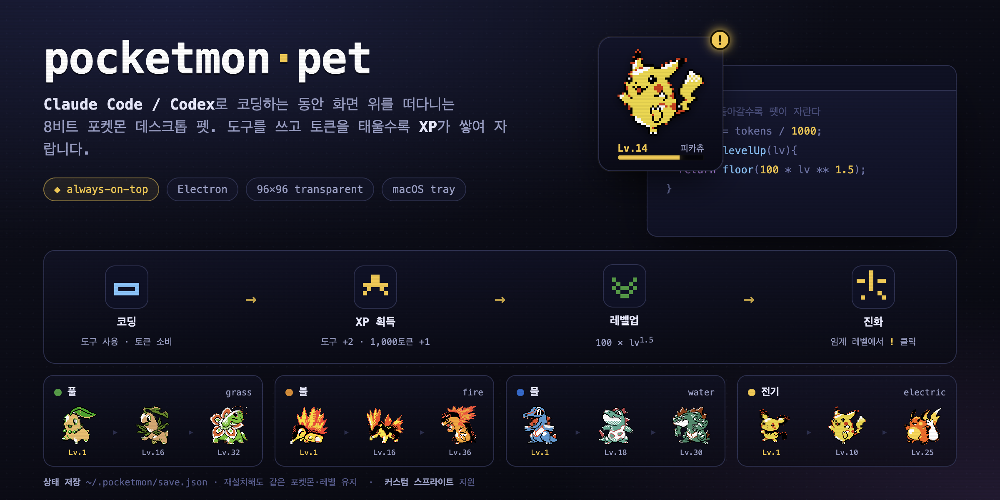
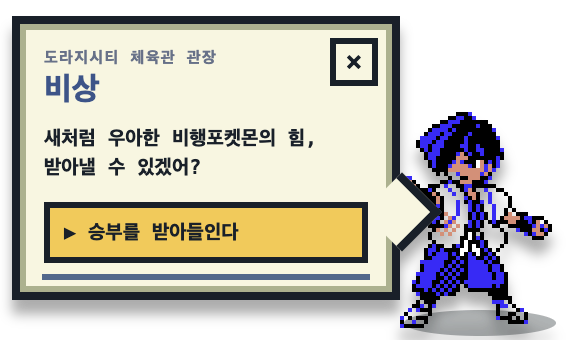
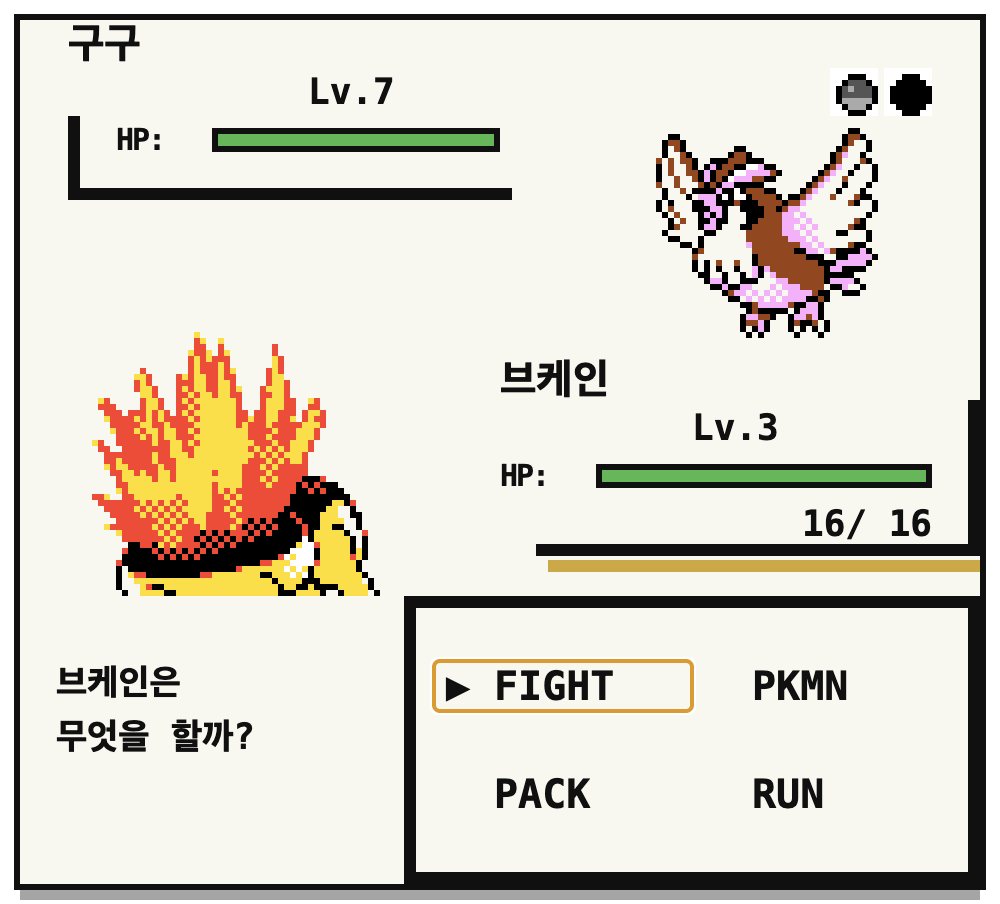

# pocketmon-pet



Claude Code / Codex로 코딩하는 동안 화면 위를 떠다니는 8비트 포켓몬 데스크톱 펫입니다.

도구를 쓰고 세션을 진행할수록 XP를 얻어 레벨업·진화하고, 야생 포켓몬과 배틀하거나
성도지방 체육관 관장에게 도전할 수 있습니다.

Electron 기반 투명·항상-위(always-on-top) 창으로 동작하며, 상태는 `~/.pocketmon/`에 저장되어 앱을 재설치해도 같은 포켓몬·레벨을 유지합니다.

## 한눈에 보기

- **코딩이 성장으로 연결됩니다.** Claude Code·Codex의 도구 사용과 토큰 소비가 XP가 됩니다.
- **데스크톱을 가리지 않습니다.** 펫과 야생 포켓몬은 투명 배경 위에 떠 있고, 펫·배틀 창은 직접 옮길 수 있습니다.
- **골드 버전 배틀을 재현합니다.** 160×144 타일 좌표, 후면 아군 스프라이트, HP 박스와 4분할 커맨드 메뉴를 사용합니다.
- **실제 로컬 시간에 따라 야생 포켓몬이 바뀝니다.** Gold의 아침·낮·밤 슬롯과 확률을 그대로 사용합니다.
- **고동마을까지 진행도가 저장됩니다.** 비상 이후 야돈의 우물 로켓단 4연전과 호일전으로 이어집니다.

## 실제 화면

<table>
  <tr>
    <td width="36%" align="center">
      <br>
      <b>야생 조우</b><br>
      배경 없이 포켓몬만 떠 있으며, 클릭해야 배틀이 시작됩니다.
    </td>
    <td width="64%" align="center">
      <br>
      <b>관장 등장</b><br>
      조건을 달성하면 펫 옆에 나타나며, 닫거나 직접 승부를 수락할 수 있습니다.
    </td>
  </tr>
</table>

<p align="center">
  <br>
  <b>Gold 스타일 배틀</b> — 아군은 후면 스프라이트로 상대를 바라보고, FIGHT·PKMN·PACK·RUN 메뉴를 사용합니다.
</p>

## 플레이 흐름

```text
코딩 → XP 획득 → 알 부화 → 레벨업·진화
                         ↓
                   야생 포켓몬 클릭
                         ↓
                     배틀·승리
                         ↓
               비상 → 윙배지 → 야돈의 우물 → 호일 → 인섹트배지
```

## 설치

```bash
npm install
```

## 실행

```bash
npm start
```

- macOS 기준(Dock 아이콘은 자동으로 숨겨지고 메뉴바 트레이 아이콘만 남습니다).
- 투명·프레임 없는 펫 창이 화면 하단 중앙 근처에 뜨고, 항상 다른 창 위에 표시됩니다(always-on-top).
- 최초에는 알 상태로 시작합니다. 2,000 XP를 모은 뒤 `!`를 클릭하면 로스터 4계열 중 하나가 랜덤으로 영구 배정됩니다.
- 선택된 포켓몬과 레벨·전적·배지·스토리 진행도는 `~/.pocketmon/save.json`에 저장되므로 재실행해도 유지됩니다.

## Hook 설치 (XP/반응이 실제로 들어오게 하려면)

포켓몬이 반응하고 성장하려면 Claude Code hook을 등록해야 합니다.

자세한 절차는 [`hook/install.md`](hook/install.md)를 참고하세요.

요약하면 `~/.claude/settings.json`의 `hooks`에 같은 커맨드(`node <레포경로>/hook/pocketmon-hook.js`)를 4개 이벤트에 등록합니다:

| 이벤트 | 의미 |
|---|---|
| `SessionStart` | 세션 시작 — 펫 등장/인사 |
| `PostToolUse` | 도구 사용 — 기술(skill) 애니메이션 + XP |
| `UserPromptSubmit` | 프롬프트 처리 시작 — 달리기(busy) 시작 |
| `Stop` | 응답 종료 — idle/walk로 복귀 |

훅은 이벤트를 `~/.pocketmon/events.jsonl`에 append만 하고, 앱이 이를 4초 간격(tick)으로 읽어 XP와 애니메이션에 반영합니다.

## 성장 규칙 (요약)

XP는 두 경로로 들어옵니다 (`src/core/xp-engine.js`):

- **Hook 이벤트**: 도구 사용 +2 XP, 세션 시작 +5 XP
- **토큰 사용량**(권위 소스 = 에이전트 자신의 세션 로그): 1,000 토큰당 +1 XP
  - Claude Code: `~/.claude/projects/**/*.jsonl`의 `message.usage`
  - Codex: `~/.codex/sessions/**/rollout-*.jsonl`의 `token_count` 이벤트
  - 두 소스는 같은 XP 풀에 합산되며, 별도 설정 없이 자동으로 인식됩니다.

일일 상한(daily cap)은 **2,000 XP**로, 하루치 XP 유입을 이 값에서 클램프합니다(로컬 자정 기준 리셋).

**과거 로그는 소급 반영하지 않습니다.** 앱을 처음 켠 시점 이후의 활동만 XP가 됩니다.

알은 누적 **2,000 XP**를 모아야 부화 가능(`!`) 상태가 되고, 그때 직접 클릭해야 종이
정해집니다(자동 부화 아님). 부화도 진화도 자동으로 일어나지 않습니다.

레벨은 XP에서 매번 재계산합니다: `필요 XP = floor(231 × level^1.5)`.

계수 231은 일일 상한을 500에서 2,000으로 올리며 실효 XP가 2.31배가 된 것을 상쇄해,
레벨업 페이스를 상한 500 시절 그대로 유지하려고 잡은 값입니다. 상한은 실사용을
온전히 반영하되, 키우는 데 걸리는 시간은 그대로 두는 것이 의도입니다.

## 로스터

4계열 × 3단계, 계열별 진화 레벨(`src/core/roster.js`):

| 계열 | 타입 | 1단계 | 2단계 (Lv) | 3단계 (Lv) |
|---|---|---|---|---|
| grass | 풀 | 치코리타 | 베이리프 (16) | 메가니움 (32) |
| fire | 불 | 브케인 | 마그케인 (16) | 블레이범 (36) |
| water | 물 | 리아코 | 엘리게이 (18) | 장크로다일 (30) |
| electric | 전기 | 피츄 | 피카츄 (10) | 라이츄 (25) |

부화할 때 이 4계열 중 하나가 랜덤으로 배정되며, 이후 고정됩니다.

## 야생 포켓몬

- 현재 구현된 도라지·고동 구간에서 Gold 원작에 출현하는 **17종**을 사용합니다.
- 한 번에 한 마리만 투명 배경 위에 나타나며, **클릭하기 전에는 배틀이 시작되지 않습니다.**
- 실행 중 최소 8분~최대 45분 간격으로 등장합니다. 평균 간격은 약 19분이며 30~50초 후 사라집니다.
- 로컬 시각 **04:00~09:59은 아침, 10:00~17:59은 낮, 18:00~03:59은 밤**으로 판정합니다.
- 윙배지 전에는 29~31번도로·모다피의 탑, 이후에는 32번도로·연결동굴·야돈의 우물 출현표를 사용합니다.
- 맵 출현률과 7개 슬롯 확률(30/30/20/10/5/4/1), 야생 레벨은 Gold 원작 수치 그대로입니다.
- 패배하면 10분 동안 새로운 야생 조우가 발생하지 않습니다.

개발 중 즉시 확인하려면 다음 테스트 훅을 사용할 수 있습니다.

```bash
POCKETMON_FORCE_TIME=nite POCKETMON_FORCE_ENCOUNTER=1 npm start
```

## 체육관 도전

현재 구현된 관장은 도라지시티의 **비상**과 고동마을의 **호일**입니다.

| 해금 조건 | 파티 | 보상 |
|---|---|---|
| 플레이어 Lv.7 이상 + 야생전 3승 | 구구 Lv.7 → 피죤 Lv.9 | 윙배지 |
| 윙배지 + Lv.14 + 야돈의 우물 해방 | 단데기 Lv.14 → 딱충이 Lv.14 → 스라크 Lv.16 | 인섹트배지 |

- 조건 달성 후 2~5분 사이에 펫 옆으로 등장하며 60초 동안 기다립니다.
- 창의 `×`로 돌려보내면 30분 뒤, 패배하면 15분 뒤 다시 등장합니다.
- 승리해 배지를 얻으면 같은 관장은 다시 출현하지 않습니다.
- 관장 파티·기술·DVs는 원작 Gold 데이터를 따릅니다.

```bash
POCKETMON_FORCE_GYM=1 npm start
POCKETMON_FORCE_BUGSY=1 npm start
```

## 야돈의 우물

- 윙배지 획득 후 Lv.14가 되면 로켓단 조무래기가 펫 옆에 순서대로 나타납니다.
- 원작의 4개 파티(꼬렛×2 → 꼬렛·주뱃×2 → 주뱃·아보 → 또가스)를 모두 이겨야 호일이 등장합니다.
- 각 승리는 즉시 저장되며, 단원 사이에는 포켓몬이 전부 회복됩니다.
- 별도 스토리 화면 없이 원본 트레이너 스프라이트와 짧은 대사 창으로 진행합니다.
- 플레이어는 한 마리만 보유하므로 상대가 다음 포켓몬을 내보낼 때마다 HP·상태가 전부 회복됩니다.

```bash
POCKETMON_FORCE_STORY=1 npm start # 1~4
```

## 배틀

- 야생전과 트레이너전 모두 Gen 2 능력치·타입 상성·명중률·급소·상태이상 계산을 사용합니다.
- 야생전과 트레이너전은 각각 Gold 원작의 성도 배틀 음악을 재생합니다.
- `FIGHT`에서 기술을 고르고, `Esc`로 기술 목록에서 커맨드 메뉴로 돌아갑니다.
- `RUN`은 야생전에서만 동작하며 도주 음악 재생 후 펫 화면으로 돌아갑니다.
- `PKMN`과 `PACK`은 원작 메뉴 위치를 보존한 자리표시자이며 아직 교체·도구 기능은 구현되지 않았습니다.
- 배틀 창은 화면을 가리지 않도록 드래그해서 옮길 수 있습니다.

## 상호작용

- **드래그**: 캔버스를 눌러서 끌면 창이 이동합니다(마우스다운~업 사이 이동량이 임계값 이상일 때 드래그로 인식).
- **호버**: 마우스를 올리면 XP 바와 상태 텍스트가 나타납니다.
- **클릭**: 이동량이 거의 없는 클릭이면 상태 표시를 고정(핀)합니다. 다시 클릭하면 핀 해제.
- 아무 조작이 없어도 펫은 idle일 때 가끔, busy(달리기)일 때는 크게 화면을 스스로 드리프트합니다.
- **트레이 메뉴**(메뉴바 아이콘): `상태 보기` / `첫 만남 다시보기` / `종료`.
- **야생 포켓몬 클릭**: 떠 있는 야생 포켓몬을 클릭하면 배틀을 시작합니다.
- **관장 도전**: 관장 창에서 승부를 수락하거나 `×`로 닫습니다.

## 수동 검증 체크리스트

- [ ] `npm start` 실행 → 투명 창에 알 또는 포켓몬이 표시되고, 메뉴바에 트레이 아이콘이 뜬다.
- [ ] hook을 등록했거나(위 참고), 직접 이벤트를 하나 흘려본다: `echo '{"hook_event_name":"PostToolUse","session_id":"manual"}' | node hook/pocketmon-hook.js` → 다음 tick(최대 4초)에 펫이 반응하고 XP가 오른다.
- [ ] 앱을 종료 후 재실행 → 같은 포켓몬·레벨이 유지된다 (`~/.pocketmon/save.json` 존재 확인).
- [ ] `POCKETMON_FORCE_ENCOUNTER=1 npm start` → 배경 없이 야생 포켓몬만 나타나고 클릭 후 배틀 창이 열린다.
- [ ] `POCKETMON_FORCE_GYM=1 npm start` → 비상 창을 닫을 수 있고, 수락하면 구구·피죤 연전이 시작된다.
- [ ] `POCKETMON_FORCE_STORY=1 npm start` → 로켓단 원본 스프라이트와 대사 창이 뜨고 순차 전투가 시작된다.
- [ ] `POCKETMON_FORCE_BUGSY=1 npm start` → 호일의 단데기·딱충이·스라크 연전과 트레이너 음악이 재생된다.

## 개발

```bash
npx vitest run   # 또는 npm test
npm run generate:pokegold-wild -- /path/to/pokegold
npm run generate:pokegold-music -- /path/to/pokegold
```

## 포켓몬 스프라이트 · 울음소리 출처

- 펫·야생 포켓몬 스프라이트는 공개 [PokéAPI/sprites](https://github.com/PokeAPI/sprites)에서
  **런타임에 내려받아** `~/.pocketmon/dex/`에 로컬 캐시한다. (트레이 메뉴 "포켓몬 스프라이트 받기"
  또는 실행 시 현재 종의 진화 라인 자동 다운로드. 오프라인·실패 시 내장 오리지널 도트로 폴백.)
- 울음소리도 동일하게 공개 [PokéAPI/cries](https://github.com/PokeAPI/cries)에서 런타임에 받아
  `~/.pocketmon/cries/`에 캐시하고, 펫을 클릭하면 재생한다(앱 번들 미포함).
- 관장·플레이어 트레이너 스프라이트와 배틀 UI 타일·기술 이펙트는
  [pret/pokegold](https://github.com/pret/pokegold)의 Gold 리소스 및 좌표 데이터를 사용한다.

## 저작권 고지

이 앱은 Nintendo·Game Freak·Creatures Inc.·The Pokémon Company와 **제휴·보증·후원·승인 관계가
전혀 없는** 개인·비상업용 팬 프로젝트다. 소스 코드는 자유롭게 사용할 수 있으나, "포켓몬" 및 관련
명칭·캐릭터·스프라이트 등 제3자 상표/저작물의 권리는 각 권리자에게 있으며 본 프로젝트는 그에 대한
어떤 권리도 주장하지 않는다. 포켓몬 스프라이트와 울음소리는 런타임에 외부 공개 소스에서 받아 개인
기기에 캐시하며, 트레이너 Gold 스프라이트와 배틀 UI·애니메이션 타일은 출처를 명시해 포함한다. 권리자의 요청이 있으면 즉시 관련
기능을 제거한다.
